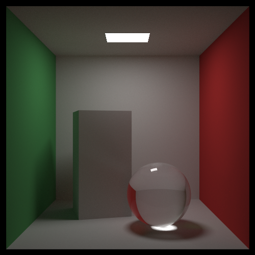

# Raytracing: the rest of your life

Golang implementation of Peter Shirley's [_Ray Tracing: The Rest of Your Life_](https://raytracing.github.io/books/RayTracingTheRestOfYourLife.html) book.

This is the program output with 10000 samples per pixel:

